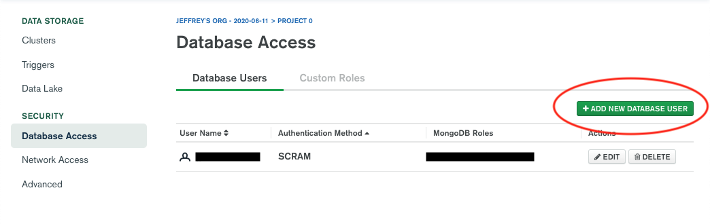

# the-power-of-without

The Power of Without is a collaborative initiative among institutions and local communities for identifying cost-efficient, lightweight infrastructure systems for deployment in informal settlements, to foster sustainable, resilient, and autonomous communities. A taxonomy, and methodology based in a set of workshops and classes has been developed to learn from informality.

https://www.media.mit.edu/projects/power-of-without-1/overview/

## Getting Started

This project runs off a Node.js backend, with a MongoDB database. Follow these steps to run the project locally:

### Configuring Dependencies

(This step only needs to be done once)

- Clone the repository locally: `git clone https://github.com/guadalupebabio/ThePowerofWithout.git`
- In the project folder, install the packages: `npm install`
  - Make sure npm is installed. If not, make sure you have [node.js](https://nodejs.org/en/download/) you can verify it entering: `node -v` you can do the same for NPM: `npm -v`.
- Install gulp locally: `npm install -g gulp`. This is necessary to compile the styles from SCSS to CSS.
- The database is hosted on MongoDB Cloud (may be migrated to another service in the future), and requires some security configuration in order for you to connect to it:
  - Email me so I can add you as an admin on the database
  - In the "Security" tab on MongoDB Cloud's dashboard, click "Database Access" and make a new database user for yourself (see below).
  
  - Create a file in the root directory of the repository called `.env` with the following layout (there is a third party database we integrate with this app, so you should also include these credentials):

  ```
  MONGODB_USERNAME=<the database username you just created>
  MONGODB_PASSWORD=<the database password you just created>
  APP_MONGODB_USERNAME=<email me, jjshen@mit.edu for these credentials>
  APP_MONGODB_PASSWORD=<email me, jjshen@mit.edu for these credentials>
  ```

  Importantly, this file is in the gitignore because you should not publish these credentials. Keep this file safe and private.

### Running the Server

(This step should be run everytime)

- Run `node index.js` in the project repository
- Run `gulp` in another terminal tab. This is necessary to compile your SCSS to CSS.   
- If everything works properly, going to localhost:3000 in your browser should work.
- *Important*: everytime you change the code, you need to re-run `node index.js` for the changes to be reflected.
  - (This is really annoying, so a potential workaround is [node-dev](https://www.npmjs.com/package/node-dev), which automatically restarts node on any changes to the code. Once you've installed node-dev, you can run `node-dev index.js` instead of `node index.js`.
  
## Project Organization 

* `index.js`: The main Node.js file
* `app`: All other Node.js files are here 
* `public`: Everything in this folder is a static file served by the frontend (don't include sensitive information here). Read more about this type of folder [here](https://expressjs.com/en/starter/static-files.html).
* `util`: This folder is deprecated, don't worry about it.
* `views`: This folder contains the Pug layouts which are rendered by the backend. Read more about Pug files [here](https://pugjs.org/api/getting-started.html).

## Run it locally
- Go to the folder where the project is locacted and type: `npm start`

## Deployment
- Once you update the site locally and push it to Github main. Go to Heroku with the user and password saved in "PoW-Crowdsource data platform" accounts tab (google spreadsheets). In Heroku go to Deploy, scroll down to Manual Deploy and click "Deploy Brunch". 
- In case it is not working or you want to go back to a previous version, go to Activity and roll back to a previous deployment.

## MongoDB
- Access [MongoDB](https://cloud.mongodb.com/) with your own user or the one you can find "PoW-Crowdsource data platform" spreadsheet. 
- Go to browse collections. This is the structure of the data:
  - comments: Comments by questions
  - Links: Links by questions
  - settlement_city_science_db: Database from City Science adapted to MongoDB structure.
  - settlementtsdatas: Data saved by settlement.
  - surveys: final survey
- To give access to someone or to edit the password of the `.env` go to Database Access.
